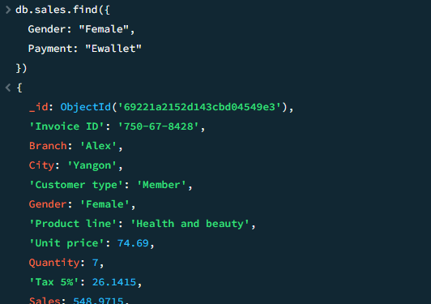
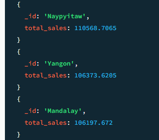
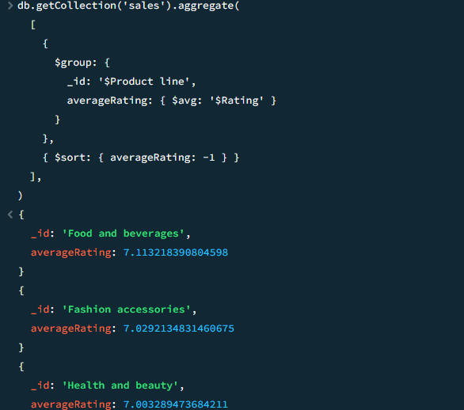
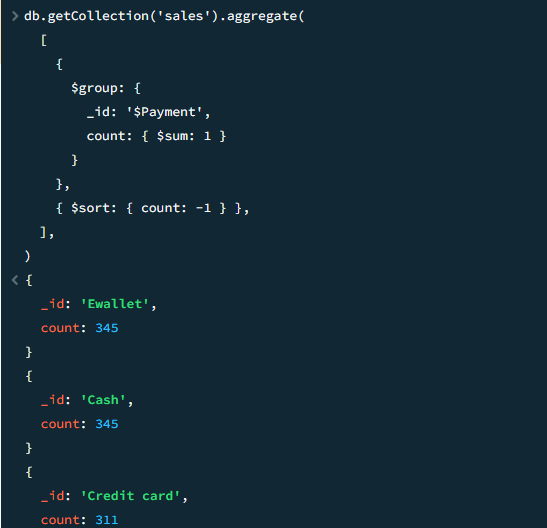

# Fase 2 – MongoDB
## 1. Caso de uso y diseño de la base de datos

Para la implementación se seleccionó el caso de uso “Ventas de supermercado”, utilizando el dataset Supermarket Sales de Kaggle. Este caso permite aplicar consultas básicas y operaciones de agregación sobre datos de ventas reales, incluyendo información de clientes, productos, métodos de pago y ganancias.

**Colección:** supermarket

### Campos principales del documento:
* `Invoice Id:` Identificador único de la venta
* `Branch:` Sucursal donde se realizó la transacción
* `City:` Ciudad de la sucursal
* `Customer Type:` Tipo de cliente (Member / Normal)
* `Gender:` Género del cliente
* `Product Line:` Categoría del producto
* `Unit Price:` Precio por unidad
* `Quantity:` Cantidad comprada
* `Tax 5:` Impuesto aplicado (5%)
* `Sales:` Total de la venta incluyendo impuesto
* `Date:` Fecha de la transacción
* `Time:` Hora de la compra
* `Payment:` Método de pago (Cash, Credit card, Ewallet)
* `Cogs:` Costo del producto antes de impuestos
* `Gross Margin Percentage:` Porcentaje de ganancia
* `Gross Income:` Ganancia obtenida en la venta
* `Rating:` Calificación del cliente

Este esquema permite realizar consultas por ciudad, sucursal, categorías, montos, métodos de pago y comportamientos del cliente.

## 2. Implementación en MongoDB
Inserción de documentos (ejemplo)
``` javascript
db.sales.insertOne({
  "Invoice Id": "ID-0001",
  "Branch": "A",
  "City": "Yangon",
  "Customer Type": "Normal",
  "Gender": "Male",
  "Product Line": "Electronic Accessories",
  "Unit Price": 55,
  "Quantity": 3,
  "Tax 5": 8.25,
  "Sales": 173.25,
  "Date": "2019-01-10",
  "Time": "10:30",
  "Payment": "Cash",
  "Cogs": 165,
  "Gross Margin Percentage": 4.7619,
  "Gross Income": 8.25,
  "Rating": 7
})
```

## 3. Consultas realizadas
Seleccion de todos los documentos
``` javascript
db.sales.find({})
```

Actualización de calificación
``` javascript
db.sales.updateOne(
  { "Invoice ID": "ID-0001" },
  { $set: { Rating: 9 } }
)
```

Eliminación
``` javascript
db.sales.deleteOne({ "Invoice ID": "ID-0001" })
```

Ventas mayores a 200:
``` javascript 
db.sales.find({ Sales: { $gt: 200 } })
```

Clientes mujeres que pagaron con Ewallet:
``` javascript 
db.sales.find({
  Gender: "Female",
  Payment: "Ewallet"
})
```



Total de ventas por ciudad:
``` javascript 
db.getCollection('sales').aggregate(
  [
    {
      $group: {
        _id: '$City',
        total_sales: { $sum: '$Sales' }
      }
    }
  ],
)
```


Promedio de rating por línea de producto:
``` javascript 
db.getCollection('sales').aggregate(
  [
    {
      $group: {
        _id: '$Product line',
        averageRating: { $avg: '$Rating' }
      }
    },
    { $sort: { averageRating: -1 } }
  ],
)
```



Método de pago más utilizado:
``` javascript 
db.getCollection('sales').aggregate(
  [
    {
      $group: {
        _id: '$Payment',
        count: { $sum: 1 }
      }
    },
    { $sort: { count: -1 } },
  ],
)
```



## Conclusion
Después de hacer las consultas en MongoDB fue posible ver varias cosas interesantes sobre las ventas. La ciudad donde más se vendió fue **Naypyitaw**, con un total aproximado de **110568.7065**, lo que muestra que esa sucursal mueve más clientes. También se vio que la categoría mejor calificada fue **Food and beverages**, con un promedio de **7.11**, así que parece ser la que más gusta a los compradores.

Además, el método de pago que más usaron los clientes fue **Cash y Ewallet**, con cerca de **345** compras, lo que demuestra qué forma de pago prefieren. En general, los datos muestran que MongoDB hace fácil buscar, agrupar y entender la información, y ayuda a encontrar patrones sin complicarse mucho.
